  

  
  
  
  
  

---

Solutions Architect focused on cloud-native and distributed systems. I design architectures on AWS that favor clear boundaries, asynchronous communication, observability, automation, and failure isolation.

I spend most of my time turning business requirements into systems that teams can actually build, operate, evolve, and debug.

### Architecture

Day to day:

- **AWS** — Lambda, API Gateway, DynamoDB, SQS, SNS, S3, CloudFront, Cognito and CloudWatch
- **Node.js / TypeScript** — services, integrations, tooling and AI agents
- **Terraform** — infrastructure as code and repeatable environments
- **GitHub Actions** — CI/CD, reusable workflows and OIDC-based deployments
- **Event-driven systems** — queues, retries, DLQs, idempotency and loosely coupled services

Also comfortable with **Java**, **Python**, containers, OpenShift and distributed integration patterns.

### Things I care about

- A queue without a dead-letter strategy is unfinished architecture.
- Retries should be designed together with idempotency.
- Observability is part of the architecture, not something added after production breaks.
- Infrastructure should be reproducible.
- Architecture diagrams should explain failure paths, not only happy paths.
- Serverless does not mean architectureless.

### What I'm exploring

Currently interested in **AI agents**, tool-calling architectures, MCP, Amazon Bedrock, multi-agent orchestration, durable workflows, and ways to connect generative AI to real production systems without turning the architecture into magic.

### 📊 Activity

  
  

### Contact

The best place to discuss one of my public projects is its issue tracker. Keeping technical context close to the code usually produces better conversations — and better documentation for whoever arrives next.

---

São Paulo, Brazil · Cloud architecture · Distributed systems · AI agents
